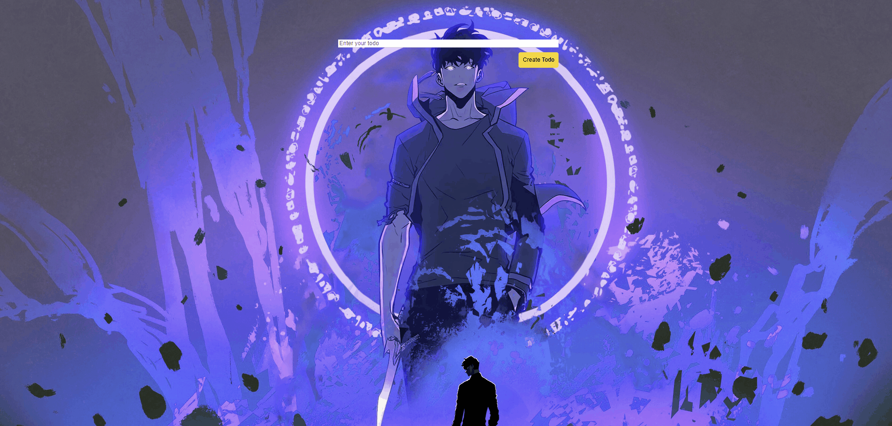

<<<<<<< HEAD
<div align="center">
  <h2>
    👉 <a href="https://todo-list-psi-ecru.vercel.app/">Live Demo</a> 👈
  </h2>
</div>

<div align="center">
  
</div>

## 📌 About The Project

A sleek and efficient todo list application built with React. Users can manage their daily tasks with a simple, intuitive interface featuring real-time updates and smooth interactions.

### ✨ Key Features

- ➕ Create new tasks easily
- ✏️ Edit existing tasks
- 🗑️ Delete tasks with one click
- 💾 Local storage persistence
- 📱 Responsive and mobile-friendly
- 🎨 Clean and modern UI
- 🔄 Real-time updates

### 🛠️ Built With

- [React](https://reactjs.org/)
- [React Icons](https://react-icons.github.io/react-icons/)
- CSS3

## 🚀 Getting Started

```bash
# Clone the repository
git clone https://github.com/yourusername/todo-list.git

# Navigate to project directory
cd todo-list

# Install dependencies
npm install

# Start the development server
npm start
```

## 💻 Project Structure

```
src/
├── components/
│   ├── TodoForm.js     # Task input form
│   └── TodoList.js     # Task list display
├── styles/
│   └── App.css
└── App.js             # Main application logic
```

## 🔍 Core Functionality

- **Task Management**: Create, edit, and delete tasks
- **Local Storage**: Persistent data across sessions
- **Input Validation**: Prevent empty task creation
- **Real-time Updates**: Instant UI refresh on changes

## 🎯 Component Details

### TodoForm Component
- Clean input interface
- Submit validation
- Clear input after submission

### TodoList Component
- Task display
- Edit/Delete options
- Completion status toggle

## 📱 Responsive Design

- Mobile-first approach
- Flexible layout system
- Touch-friendly interface
- Clean visual hierarchy

## 🤝 Contributing

Contributions make the open source community an amazing place to learn, inspire, and create. Any contributions you make are **greatly appreciated**.

## 📄 License

Distributed under the MIT License. See `LICENSE` for more information.

## 📫 Contact

Caner Yesiltas - caneryesiltas1@gmail.com

Project Link: [https://todo-list-psi-ecru.vercel.app/](https://todo-list-psi-ecru.vercel.app/)

---

<div align="center">
  Made with ❤️ by Caner Yesiltas
</div>
=======

>>>>>>> 04df5d44d393379e6a948493b5d98cf9eb427167
